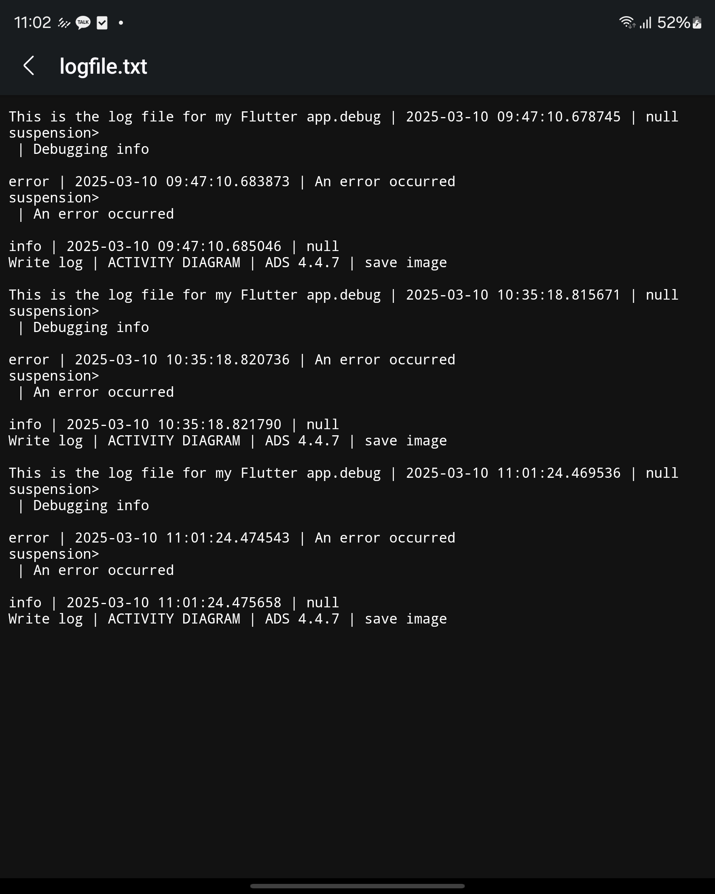
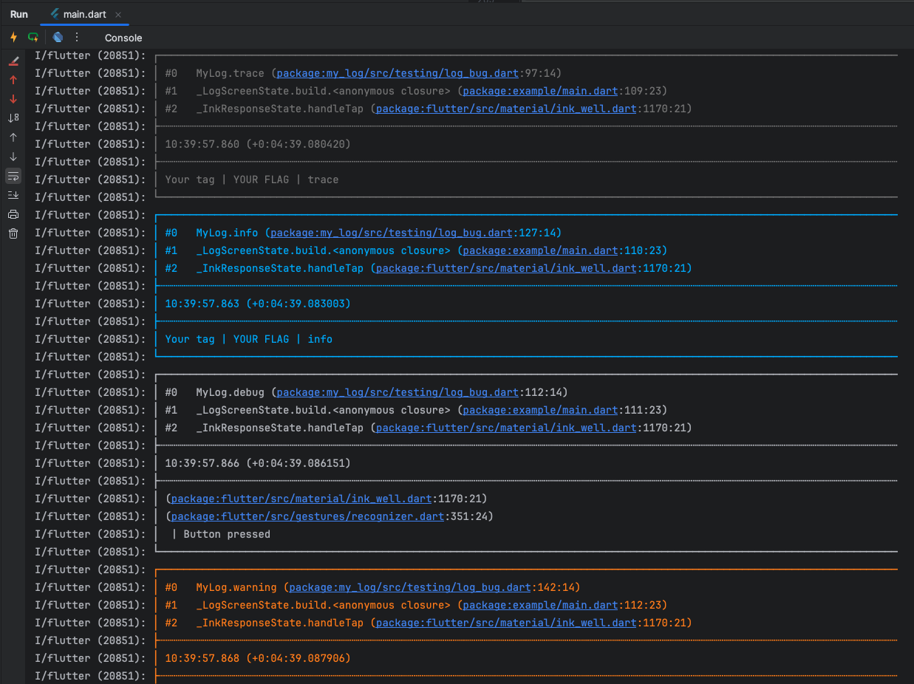
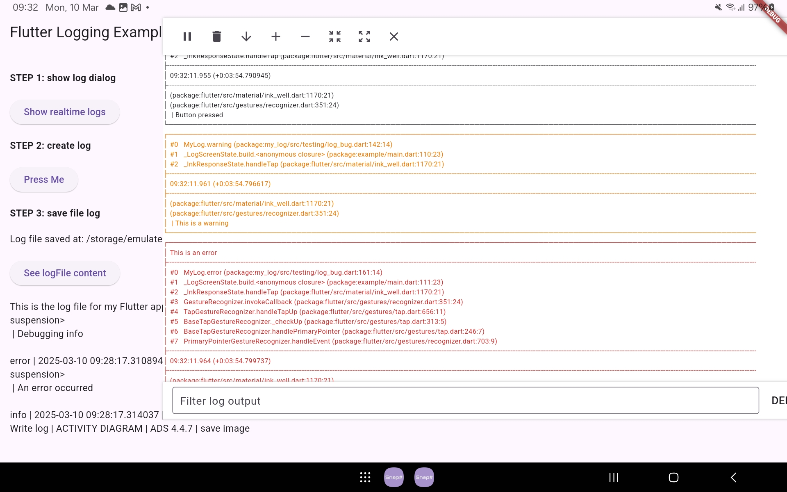

[](https://codecov.io/gh/ngmduc2012/my_log)
[](https://github.com/ngmduc2012)
_[](https://www.buymeacoffee.com/ducmng12g)_
_[](https://paypal.me/ngmduc)_
_[](https://github.com/sponsors/ngmduc2012)_
_[](https://ko-fi.com/I2I81AEJG8)_

# Colored Logs, Float Logs

## Introduction
Logging is an essential aspect of application development, helping developers monitor application behavior, debug issues, and maintain logs for future reference. The `MyLog` package provides a powerful logging system that allows you to:
- Set up colored logs for better readability.
- Save log files to the device memory.
- Display logs in real-time on the screen.
- Switch the application mode to development mode.

## Installation and Usage

### 1. Add the Package to Your `pubspec.yaml`
To get started, add `MyLog` as a dependency in your Flutter project by modifying your `pubspec.yaml` file:

```yaml
dependencies:
  my_log: ^latest_version
```

Then, run the following command to fetch the package:
```sh
flutter pub get
```

### 2. Initialize Logging in Your App
To properly initialize logging, configure `MyLog` in your main application file.

In the `main()` function of your application, after calling `WidgetsFlutterBinding.ensureInitialized();`, initialize `MyLog` using the `setUp()` function:

```dart

void main() async {
  WidgetsFlutterBinding.ensureInitialized();
  await myLog.setUp(
    path: 'path/to/your/logfile.txt', // Specify the log file path. This is OPTION
    printTime: true, // Enables timestamp in logs.
    isLogging: true, // Enables logging.
    noteInfoFileLog: 'This is the log file for my Flutter app.',
  );
  runApp(MyApp());
}
```
Result:



Once configured, logs will be saved to the specified file path.

### 3. Using Logging Methods
Throughout your application, use the logging methods provided by the `MyLog` class to record messages at different levels (trace, debug, info, warning, error, fatal).
Tags and flags allow you to easily search for and track logs if they belong to a specific thread or function.
Example usage:
```dart
myLog.info('info', tag: "WSS", flag: "Payment feature");
myLog.debug('Button pressed');
myLog.warning('This is a warning');
myLog.error('This is an error');
```
Result:



### 4. Display Logs on Screen for Easy Tracking
To view logs in real-time on your application screen, follow these steps:



#### Step 1: Declare a Global Controller
Declare a global controller for log display:
```dart
MyConsoleLogController consoleLogController = MyConsoleLogController();
```

#### Step 2: Wrap Your Widget Tree in `MyConsoleLog`
Modify your `MaterialApp` builder to include `MyConsoleLog`:

```dart
return MaterialApp(
  builder: (context, child) {
    return MyConsoleLog(
      controller: consoleLogController,
      children: [
        LogScreen(logPath: logPath)
      ],
    );
  },
);
```

#### Step 3: Toggle Real-Time Log Display
To enable real-time log display, call the `setShowConsoleLog(true)` function:

```dart
ElevatedButton(
  onPressed: () {
    consoleLogController.setShowConsoleLog(true);
  },
  child: const Text('Show realtime logs'),
)
```

If you want to know what i do in package, checking my document here https://wong-coupon.gitbook.io/flutter/easy-code/log-color

## Developer Team:
Any comments please contact us [ThaoDoan](https://github.com/mia140602) and [DucNguyen](https://github.com/ngmduc2012)

